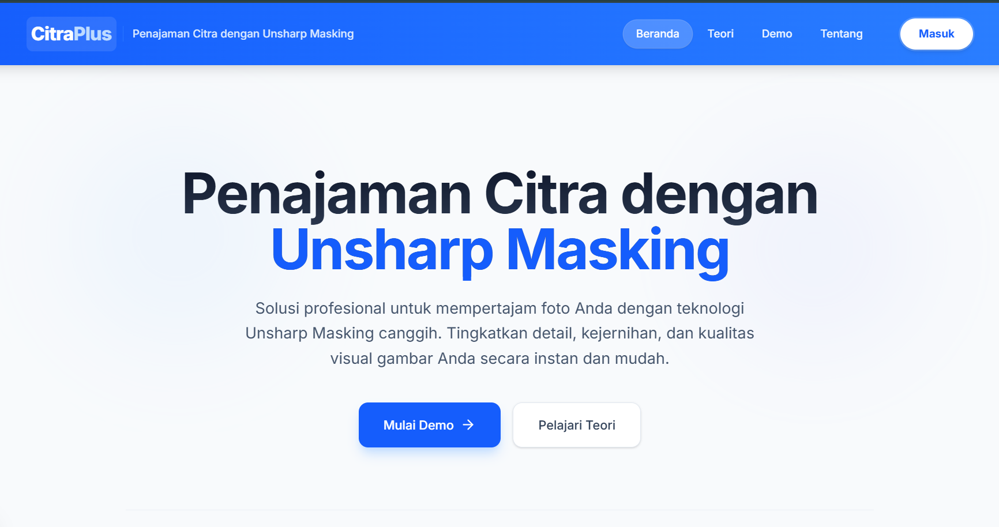

# Citra Plus 📸

Aplikasi web pemrosesan citra (Image Processing) yang menggunakan **Next.js** untuk Frontend dan **Python Flask (OpenCV)** untuk Backend.



## Fitur
- **Unsharp Masking**: Mempertajam detail gambar menggunakan algoritma unsharp mask di ruang warna LAB.
- **AI Enhancement**: Simulasi perbaikan kualitas gambar (denoise, saturasi, kecerahan).
- **Document Mode**: Optimasi khusus untuk dokumen teks (CLAHE + Gamma Correction).
- **Real-time Preview**: Melihat hasil unsharp mask secara langsung.

## Arsitektur
- **Frontend**: Next.js 14, React, Tailwind CSS. Berfungsi sebagai UI dan Proxy.
- **Backend API**: Python Flask, OpenCV, NumPy. Menangani logika pemrosesan citra berat.

## Cara Menjalankan Project

Anda perlu menjalankan **Frontend** dan **Backend** secara bersamaan di terminal yang berbeda.

### 1. Backend (Python Flask)

Pastikan Python sudah terinstall.

```bash
# Masuk ke folder root project
cd citra-plus

# Install dependensi (hanya perlu sekali)
python -m pip install -r backend/requirements.txt

# Jalankan server Flask (Default port: 5000)
python backend/app.py
```

### 2. Frontend (Next.js)

Buka terminal **baru** (biarkan terminal backend tetap jalan).

```bash
# Masuk ke folder root project
cd citra-plus

# Install dependensi (hanya perlu sekali)
npm install

# Jalankan server Next.js (Default port: 3000)
npm run dev
```

### 3. Akses Aplikasi

Buka browser dan kunjungi [http://localhost:3000/demo](http://localhost:3000/demo).

---

## Struktur Folder

- `/app`: Kode sumber Frontend Next.js.
- `/backend`: Kode sumber Backend Python Flask.
  - `app.py`: Entry point server Flask.
  - `image_utils.py`: Logika pemrosesan citra (OpenCV).
